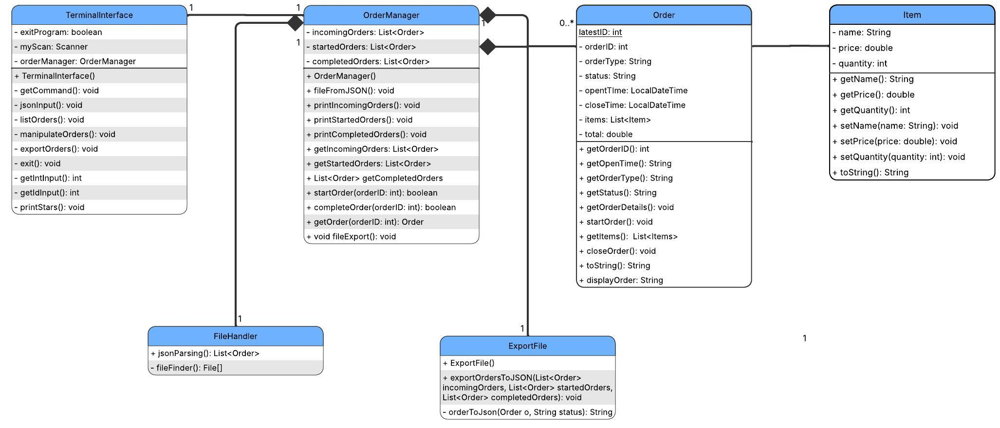
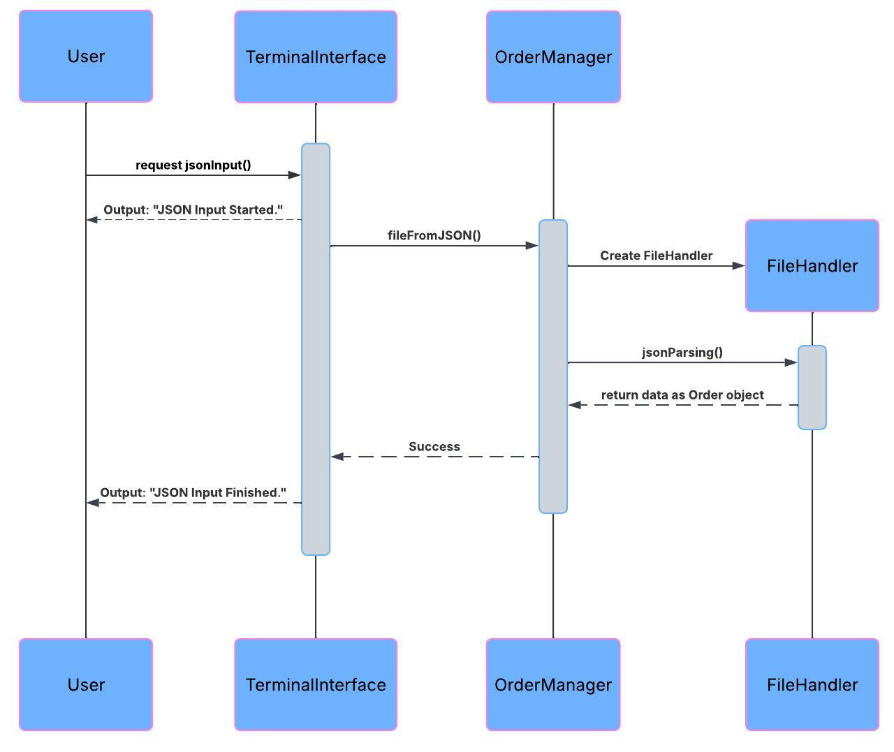

# ICS 372 Object Oriented Design and Implementation Group Project
### Contributors: Jordan Curtis, Majid Farah, Tommy Fenske, Ruben Vallejo, Kheder Yusuf

### Class Diagram

### Sequence Diagram

## Project Instructions:
Your assignment is to design and build a tracking system for a restaurant that receives online orders
through a 3rd party (FoodHub). Restaurant staff will need to be able to add orders that arrive, start orders
so they can be prepared, and close orders which have been completed. It will be evaluated against the
following requirements:
1. The software shall read a file that is in JSON format containing various order information.
2. The software shall support 2 different types of orders in the input file: to go order and
pickup order.
3. The software shall read and store the order type, order time, food items, quantity, and item
price of each order and associate it with the specified order ID.
4. The software shall support the following commands for each order: start incoming order,
display incoming order, and complete incoming order.
5. The software shall only allow starting an incoming order if that order has not been started
or completed.
6. The software shall keep records for an order that has been completed.
7. The software shall be able to export all orders into a single JSON file.
8. The software shall show the list of all uncompleted orders including the price total for the
order.
Usage of the Java standard libraries or other libraries as part of your program is expected. Make sure
you include external jar files with your source when you submit it. Documentation of the software is
expected as well. Be sure to include a class diagram of the program and a sequence diagram of the add
incoming order operation.
